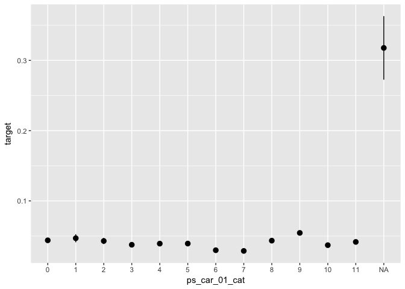

Introduction to Predictive Modeling
================
<maximilian.eber@quantco.com>, <fabian.fraenz@quantco.com>
28/11/2017

-   [Setup](#setup)
    -   [Load libraries](#load-libraries)
    -   [Load data](#load-data)
-   [Summary statistics](#summary-statistics)
    -   [Histograms](#histograms)
    -   [Correlation of predictors and outcome](#correlation-of-predictors-and-outcome)
-   [Basic linear model](#basic-linear-model)
    -   [Train model](#train-model)
    -   [Evaluate performance](#evaluate-performance)
    -   [Plot model fit along covariates](#plot-model-fit-along-covariates)
-   [Boosted Trees](#boosted-trees)
    -   [Prepare data](#prepare-data)
    -   [Train model](#train-model-1)
    -   [Feature importance](#feature-importance)
    -   [Feature engineering](#feature-engineering)
-   [Additional Tasks](#additional-tasks)

In this workshop, we will introduce you to some of the most important concepts in predictive modeling. We will use a dataset from the insurance company *Porto Seguro* (via kaggle.com). The dataset contains driver characteristics and an indicator for whether the driver had an accident in a given year or not. The goal is to identify safe drivers by modeling accidents. We will first conduct an exploratory data analysis, then build a basic linear model, and finally use a boosted trees algorithm to improve the accuracy of our model. Along the way, we will think about feature engineering, different metrics for model evaluation, overfitting, hyperparameter tuning, and cross-validation.

Setup
=====

Load libraries
--------------

``` r
rm(list = ls())
library(readr)
library(dplyr)
library(xgboost)
library(ggplot2)
library(tidyr)
library(pROC)
library(forcats)
```

Load data
---------

``` r
# Load data and recode
if (!file.exists("train.csv")) {
  message("Data not found. Please download and unzip from https://www.kaggle.com/c/porto-seguro-safe-driver-prediction/download/train.7z")
}
data <- read_csv("train.csv") %>% 
  mutate_at(vars(ends_with("_cat")),   funs(factor(., exclude = -1))) %>%
  mutate_at(vars(ends_with("_bin")),   funs(if_else(. == -1, as.integer(NA), as.integer(.)))) %>% 
  mutate_at(vars(matches("_[0-9]+$")), funs(if_else(. == -1, as.numeric(NA), as.numeric(.)))) %>% 
  select(-id)
```

Summary statistics
==================

Histograms
----------

``` r
# Histogram of outcome variable
data %>% ggplot(aes(x = target)) + geom_histogram()
```


``` r
# Histograms of selected predictors

# - Example (continuous variable)
data %>% ggplot(aes(x = ps_reg_02)) + geom_histogram(bins = 50)
```


``` r
# - Example (categorical variable):
data %>% ggplot(aes(x = ps_car_01_cat)) + geom_bar()
```


**TODO**: Select a few important variables and plot their distribution.

Correlation of predictors and outcome
-------------------------------------

``` r
# Correlation of selected predictors with outcome variables

# - Example (continuous variable)
data %>% 
  ggplot(aes(x = ps_reg_02, y = target)) + 
  stat_summary_bin(fun.data = "mean_se", bins = 50)
```


``` r
# - Example (categorical variable):
data %>% 
  ggplot(aes(x = ps_car_01_cat, y = target)) + 
  stat_summary(fun.data = "mean_se")
```



**TODO**: Select a few important variables and plot their correlation with the outcome variable.

Basic linear model
==================

Train model
-----------

``` r
# Problem: How to deal with missing values?
data %>% count(is.na(ps_car_01_cat))
```

    ## # A tibble: 2 x 2
    ##   `is.na(ps_car_01_cat)`      n
    ##                    <lgl>  <int>
    ## 1                  FALSE 595105
    ## 2                   TRUE    107

``` r
# Solution: Code explicitly
data_glm <- data %>% 
  select(target, ps_reg_02, ps_car_01_cat) %>% 
  mutate(
    # ps_car_01_cat (categorical)
    ps_car_01_cat = forcats::fct_explicit_na(ps_car_01_cat),
    # ps_reg_02 (continuous)
    ps_reg_02_missing = if_else(is.na(ps_reg_02), 1, 0),
    ps_reg_02 = if_else(is.na(ps_reg_02), 0, ps_reg_02)
  )
# Here, we build a simple linear model based on a few features  
glm0 <- glm(data = data_glm, formula = target ~ ps_reg_02 + ps_car_01_cat, family = "binomial") # ignore missing indicator
# glm0 <- glm(data = data_glm, formula = target ~ ps_reg_02 + ps_reg_02_missing + ps_car_01_cat, family = "binomial") # including missing indicator
summary(glm0)
```

    ## 
    ## Call:
    ## glm(formula = target ~ ps_reg_02 + ps_car_01_cat, family = "binomial", 
    ##     data = data_glm)
    ## 
    ## Deviance Residuals: 
    ##     Min       1Q   Median       3Q      Max  
    ## -1.0319  -0.2861  -0.2668  -0.2412   2.7026  
    ## 
    ## Coefficients:
    ##                         Estimate Std. Error z value Pr(>|z|)    
    ## (Intercept)            -3.256688   0.064181 -50.742  < 2e-16 ***
    ## ps_reg_02               0.344703   0.016483  20.912  < 2e-16 ***
    ## ps_car_01_cat1          0.029441   0.143029   0.206  0.83692    
    ## ps_car_01_cat2         -0.052820   0.124147  -0.425  0.67050    
    ## ps_car_01_cat3         -0.193630   0.090575  -2.138  0.03254 *  
    ## ps_car_01_cat4         -0.067387   0.071163  -0.947  0.34367    
    ## ps_car_01_cat5         -0.040520   0.074289  -0.545  0.58546    
    ## ps_car_01_cat6         -0.362637   0.067830  -5.346 8.98e-08 ***
    ## ps_car_01_cat7         -0.369121   0.065219  -5.660 1.52e-08 ***
    ## ps_car_01_cat8          0.006987   0.075099   0.093  0.92588    
    ## ps_car_01_cat9          0.220464   0.070705   3.118  0.00182 ** 
    ## ps_car_01_cat10        -0.198649   0.067854  -2.928  0.00342 ** 
    ## ps_car_01_cat11        -0.090880   0.064545  -1.408  0.15913    
    ## ps_car_01_cat(Missing)  2.456132   0.217447  11.295  < 2e-16 ***
    ## ---
    ## Signif. codes:  0 '***' 0.001 '**' 0.01 '*' 0.05 '.' 0.1 ' ' 1
    ## 
    ## (Dispersion parameter for binomial family taken to be 1)
    ## 
    ##     Null deviance: 186283  on 595211  degrees of freedom
    ## Residual deviance: 185001  on 595198  degrees of freedom
    ## AIC: 185029
    ## 
    ## Number of Fisher Scoring iterations: 6

Evaluate performance
--------------------

``` r
# Evaluate in-sample accuracy (metric: AUC)
predicted <- predict(object = glm0, newdata = data_glm, type = "response")
actual <- data_glm %>% pull(target)
auc(actual, predicted)
```

    ## Area under the curve: 0.5688

``` r
roc(actual, predicted, plot = TRUE, grid = TRUE)
```


    ## 
    ## Call:
    ## roc.default(response = actual, predictor = predicted, plot = TRUE,     grid = TRUE)
    ## 
    ## Data: predicted in 573518 controls (actual 0) < 21694 cases (actual 1).
    ## Area under the curve: 0.5688

**TODO**: Explain intuitively what this metric does. Why is better than using, say, accuracy?

Plot model fit along covariates
-------------------------------

``` r
# Plot predicted vs. actual along a few variables

# Example: 
data_glm %>% 
  mutate(predicted = predict(object = glm0, newdata = ., type = "response")) %>% 
  ggplot(aes(x = ps_reg_02)) + 
  stat_summary_bin(aes(y = target, color = "actual"), fun.data = "mean_se") + 
  stat_summary_bin(aes(y = predicted, color = "predicted"), fun.data = "mean_se")
```


**TODO**: Evaluate the fit of your model along a few more variables. What does this imply for feature engineering? Hint: The numnber of missing values per row is known to be predictive.

**TODO**: Avoid overfitting:

-   Split the sample in train (50%) and test (50%). Remember to set a seed for reproducability
-   Build the model on the training data only
-   What is the AUC on the training data? What is the AUC on the test data? Why do they differ

**TODO**: Add a few variables to your model. Does the training AUC improve as you add variables? How about the testing AUC?

Boosted Trees
=============

Prepare data
------------

``` r
# Prepare data for XGBOOST
# - This is necessary to comply with the inner workings of the packages (not native R, optimized for performance)
options(na.action = "na.pass") # keep NAs

# create model matrix, vector with labels, vector with sample (train, test)

dat_x <- model.matrix(data = data, object = target ~ ps_reg_02 + ps_car_01_cat)
dat_y <- data %>% pull(target)

# This creates a "one-hot encoded" matrix:
head(dat_x) 
```

    ##   (Intercept) ps_reg_02 ps_car_01_cat1 ps_car_01_cat2 ps_car_01_cat3
    ## 1           1       0.2              0              0              0
    ## 2           1       0.4              0              0              0
    ## 3           1       0.0              0              0              0
    ## 4           1       0.2              0              0              0
    ## 5           1       0.6              0              0              0
    ## 6           1       1.8              0              0              0
    ##   ps_car_01_cat4 ps_car_01_cat5 ps_car_01_cat6 ps_car_01_cat7
    ## 1              0              0              0              0
    ## 2              0              0              0              0
    ## 3              0              0              0              1
    ## 4              0              0              0              1
    ## 5              0              0              0              0
    ## 6              0              0              0              0
    ##   ps_car_01_cat8 ps_car_01_cat9 ps_car_01_cat10 ps_car_01_cat11
    ## 1              0              0               1               0
    ## 2              0              0               0               1
    ## 3              0              0               0               0
    ## 4              0              0               0               0
    ## 5              0              0               0               1
    ## 6              0              0               1               0

``` r
# Create indicators for train-test split
set.seed(281701)
select_train = sample(c(TRUE, FALSE), prob = c(0.5, 0.5), replace = TRUE, size = nrow(dat_x))
select_valid = !select_train

# create data sets for training and validation
train_xgb <- xgb.DMatrix(data = dat_x[select_train,], label = dat_y[select_train])
valid_xgb <- xgb.DMatrix(data = dat_x[select_valid,], label = dat_y[select_valid])
```

Train model
-----------

``` r
xgb0 <- xgb.train(
  data            = train_xgb,
  watchlist       = list(train = train_xgb, validation = valid_xgb),
  objective       = "binary:logistic",
  eval_metric     = "auc",
  nrounds         = 100,
  print_every_n   = 25,
  verbose         = 1,
  eta             = 0.1,
  gamma           = 0,
  nthread         = parallel::detectCores(),
  seed            = 182064,
  grow_policy     = "lossguide")
```

    ## [1]  train-auc:0.564797  validation-auc:0.562611 
    ## [26] train-auc:0.573547  validation-auc:0.568837 
    ## [51] train-auc:0.577292  validation-auc:0.568816 
    ## [76] train-auc:0.578426  validation-auc:0.567924 
    ## [100]    train-auc:0.578877  validation-auc:0.567208

``` r
# Print evaluation log
xgb0$evaluation_log %>% 
  ggplot(aes(x = iter)) + 
  geom_line(aes(y = train_auc, color = "train")) +
  geom_line(aes(y = validation_auc, color = "validation"))
```


**TODO**: Estimate the model for various other hyperparameters (e.g. eta, nrounds, gamma, max\_depth).

-   How does the evaluation log change?
-   What are good parameters for eta and nrounds?

Feature importance
------------------

``` r
# Print feature importance
xgb0 %>% 
  xgb.importance(feature_names = colnames(dat_x)) %>% 
  xgb.ggplot.importance()
```


``` r
# Training:
data_glm[select_train, ] %>%  # select training part only
  mutate(predicted = predict(object = xgb0, newdata = train_xgb, type = "response")) %>% 
  ggplot(aes(x = ps_reg_02)) + 
  stat_summary_bin(aes(y = target, color = "actual"), fun.data = "mean_se") + 
  stat_summary_bin(aes(y = predicted, color = "predicted"), fun.data = "mean_se")
```


``` r
# Testing:
data_glm[select_valid, ] %>%  # select training part only
  mutate(predicted = predict(object = xgb0, newdata = valid_xgb, type = "response")) %>% 
  ggplot(aes(x = ps_reg_02)) + 
  stat_summary_bin(aes(y = target, color = "actual"), fun.data = "mean_se") + 
  stat_summary_bin(aes(y = predicted, color = "predicted"), fun.data = "mean_se")
```


**TODO**: Choose a high value (e.g. 5) for gamma and see how these plots change. Why?

**TODO**: Add new feature (e.g. number of NAs per row) - Does it improve accuracy? - Where does it show up in feature importance?

Feature engineering
-------------------

**TODO**: Feature Engineering - Build new features\* - Evaluate distribution and correlation with outcome variable - Add it to your boosted tree - Where does it show up in feature importance? - Does accuracy improve?

**Hint**: try adding the number of NAs per row in addition to the two variables above:

``` r
dat_x <- data %>% 
  mutate(number_nas = rowSums(is.na(as_data_frame(.) %>% select(-target)))) %>% 
  model.matrix(object = target ~ ps_reg_02 + ps_car_01_cat + number_nas)
```

Additional Tasks
================

**TODO**: Build a model with all features.

**TODO**: Cross-validate results.

**TODO**: Evaluate partial dependency for some variables.
